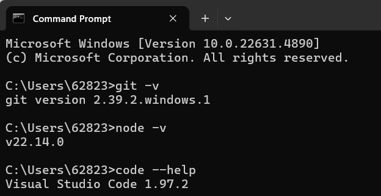
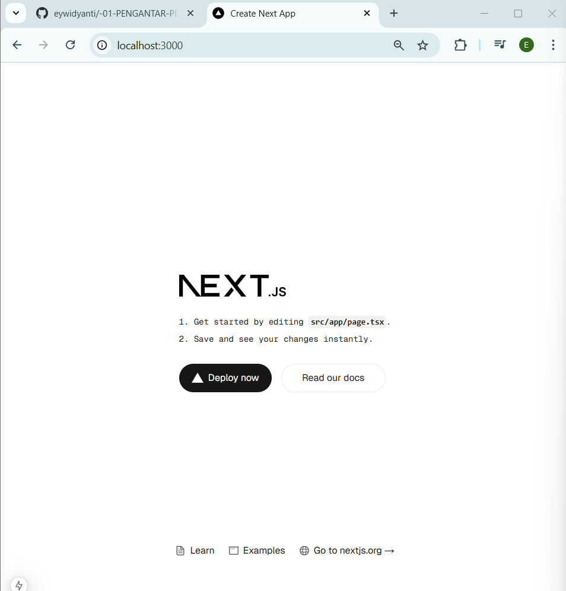
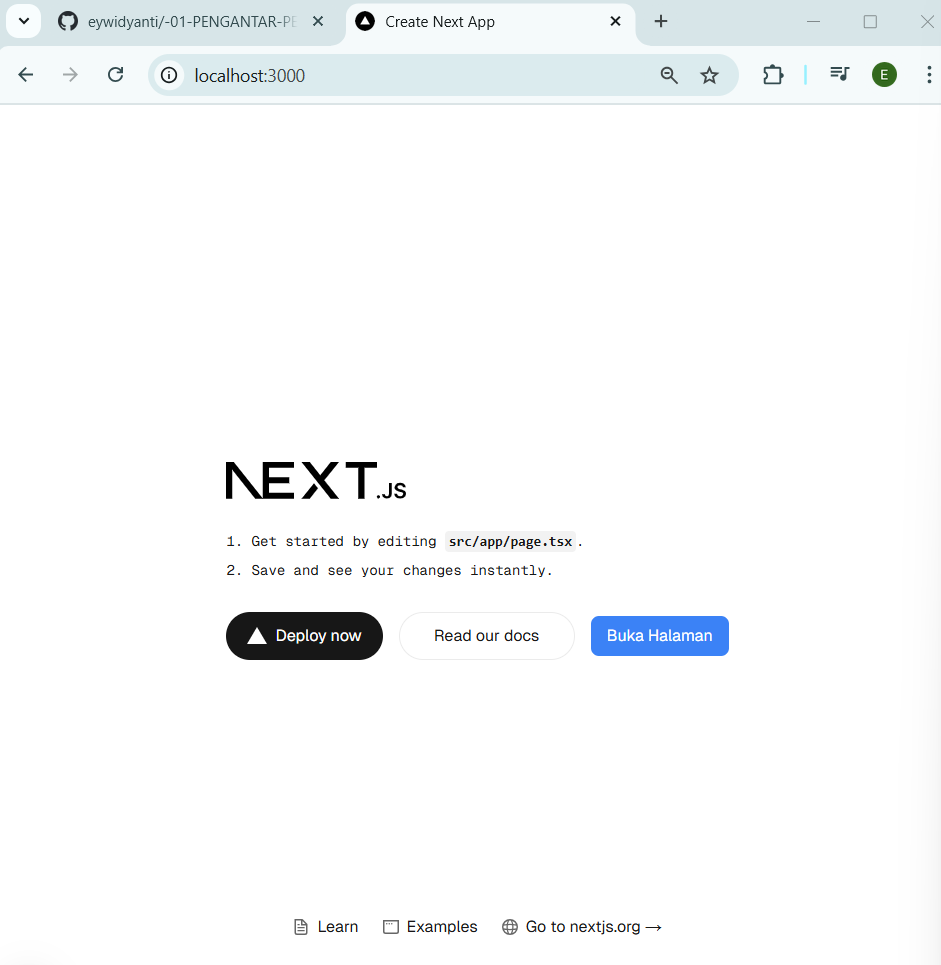
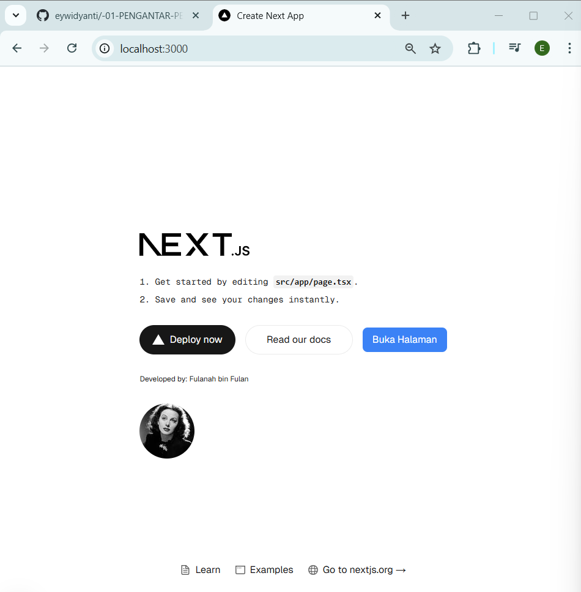

Praktikum 1: Menyiapkan Lingkungan Pengembangan

Pertanyaan Praktikum 1
1. Jelaskan kegunaan masing-masing dari Git, VS Code dan NodeJS yang telah Anda install pada sesi praktikum ini!
    - Git = digunakan untuk mengelola dan melacak perubahan pada kode program , memudahkan proses pengerjaan proyek
    - VS Code = text editor yang digunakan untuk menulis kode program 
    - NodeJs = digunakan untuk mengembangkan aplikasi web berbasis JavaScript
2. Buktikan dengan screenshoot yang menunjukkan bahwa masing-masing tools tersebut telah berhasil terinstall di perangkat Anda!
    

Praktikum 2: Membuat Proyek Pertama React Menggunakan Next.js

Pertanyaan Praktikum 2
1. Pada Langkah ke-2, setelah membuat proyek baru menggunakan Next.js, terdapat beberapa istilah yang muncul. Jelaskan istilah tersebut, TypeScript, ESLint, Tailwind CSS, App Router, Import alias, App router, dan Turbopack!
    - TypeScript = Bahasa pemrograman superset dari JavaScript yang mendukung penulisan kode dengan tipe data statis. 
    - ESLint = Salah satu tools JavaScript yang dapat membantu menemukan dan memperbaiki kesalahan pada kode.
    - Tailwind CSS = Framework CSS berbasis utility-first yang digunakan untuk membuat tampilan web yang kompleks dengan mudah
    - App Router = App Router di Next.js adalah sistem perutean yang menggunakan folder app/ untuk mengatur halaman dan tata letak aplikasi.
    - Import alias = Nama alternatif yang digunakan untuk menggantikan jalur panjang dalam berkas kode
    - Turbopack = Bundler inkremental yang dioptimalkan untuk JavaScript dan TypeScript
2. Apa saja kegunaan folder dan file yang ada pada struktur proyek React yang tampil pada gambar pada tahap percobaan ke-3!
    - Folder
        - .next = Folder build otomatis yang dibuat saat menjalankan proyek Next.js. Berisi file hasil kompilasi untuk meningkatkan performa.
        - node_modules = Menyimpan semua dependensi dan library yang diinstal melalui npm atau yarn.
        - public = Folder untuk menyimpan aset statis seperti gambar dan ikon.
        - src\app = Folder utama yang digunakan dalam App Router Next.js. Berisi file untuk tata letak dan halaman aplikasi.
    - File
        - favicon.ico = Ikon kecil yang muncul di tab browser.
        - globals.css = File CSS global yang digunakan di seluruh aplikasi.
        - layout.tsx = File untuk mengatur tata letak utama aplikasi (misalnya header, sidebar, footer).
        - page.tsx = Halaman utama aplikasi yang ditampilkan.
        - .gitignore = Menentukan file dan folder yang harus diabaikan oleh Git.
        - eslint.config.mjs = Konfigurasi ESLint untuk memastikan kode tetap bersih dan sesuai standar.
        - next-env.d.ts = File deklarasi TypeScript untuk Next.js, memastikan dukungan TypeScript yang benar.
        - next.config.ts = File konfigurasi Next.js untuk mengatur pengaturan khusus proyek.
        - package-lock.json = Menyimpan versi pasti dari dependensi yang diinstal untuk menjaga konsistensi proyek.
        - package.json = Berisi informasi proyek dan daftar dependensi yang digunakan.
        - postcss.config.mjs = Konfigurasi untuk PostCSS, biasanya digunakan bersama Tailwind CSS.
        - Readme.md = File dokumentasi proyek yang berisi petunjuk atau informasi tambahan.
        - tailwind.config.ts =  Konfigurasi untuk Tailwind CSS, digunakan untuk menyesuaikan gaya tampilan.
        - tsconfig.json = Konfigurasi TypeScript untuk menentukan aturan penulisan kode di proyek.
3. Buktikan dengan screenshoot yang menunjukkan bahwa tahapan percobaan di atas telah berhasil Anda lakukan!

Praktikum 3: Menambahkan Komponen React (Button)

Pertanyaan Praktikum 3
1. Buktikan dengan screenshoot yang menunjukkan bahwa tahapan percobaan di atas telah berhasil Anda lakukan!

Praktikum 4: Menulis Markup dengan JSX

Pertanyaan Praktikum 4
1. Untuk apakah kegunaan sintaks user.imageUrl?

    Sintaks user.imageUrl digunakan untuk mengambil URL gambar pada objek user

2. Buktikan dengan screenshoot yang menunjukkan bahwa tahapan percobaan di atas telah berhasil Anda lakukan!

